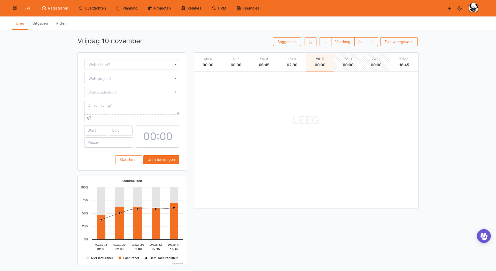

# TimeChimp billability extension

Shows your billability of the last 5 weeks, on basis of the hours within TimeChimp.

Each week includes the average billability of the 4 weeks before. Whenever a week only has days booked on leave or public holidays, a week earlier is used for the average calculation.

## Usage

The simplest way to use the extension is via the extension marketplace for your browser.

- [Firefox](https://addons.mozilla.org/en-US/firefox/addon/timechimp-billability-chart)
- [Chrome and Edge](https://chrome.google.com/webstore/detail/timechimp-billability-cha/eleodjmnfjlgiidglnlfclhffhgkgpdp)

## Quick Start

```shell
# Install the dependencies
npm install

# Start the build in watch mode
npm start

# Run the type checks
npm run type-check

# Format the code
npm run format
```

To load the extension in your browser, check the docs for [Chrome](https://developer.chrome.com/docs/extensions/mv3/getstarted/development-basics/#load-unpacked) or [Firefox](https://developer.mozilla.org/en-US/docs/Mozilla/Add-ons/WebExtensions/Your_first_WebExtension#installing).

## Developing the extension

First, you need to clone the repository, and install all dependencies:

```shell
git clone ...

npm install
```

To build the extension in watch mode, you can run:

```shell
npm start
```

This will generate various build folders for Chrome and Firefox.
These are called `build_chrome` and `build_firefox` respectively.
You can now load this as an unpacked extension in your browser.
For more info on how to do that, check the instructions for [Chrome](https://developer.chrome.com/docs/extensions/mv3/getstarted/development-basics/#load-unpacked) or [Firefox](https://developer.mozilla.org/en-US/docs/Mozilla/Add-ons/WebExtensions/Your_first_WebExtension#installing).

After making changes, be sure to click the "reload" button to let your browser reload the extension code.
Without this, you won't see your changes in the browser.

You can now open [TimeChimp](https://app.timechimp.com/#/registration/time/day),
and you should see the billability chart right below the time entry form.


