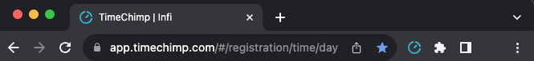
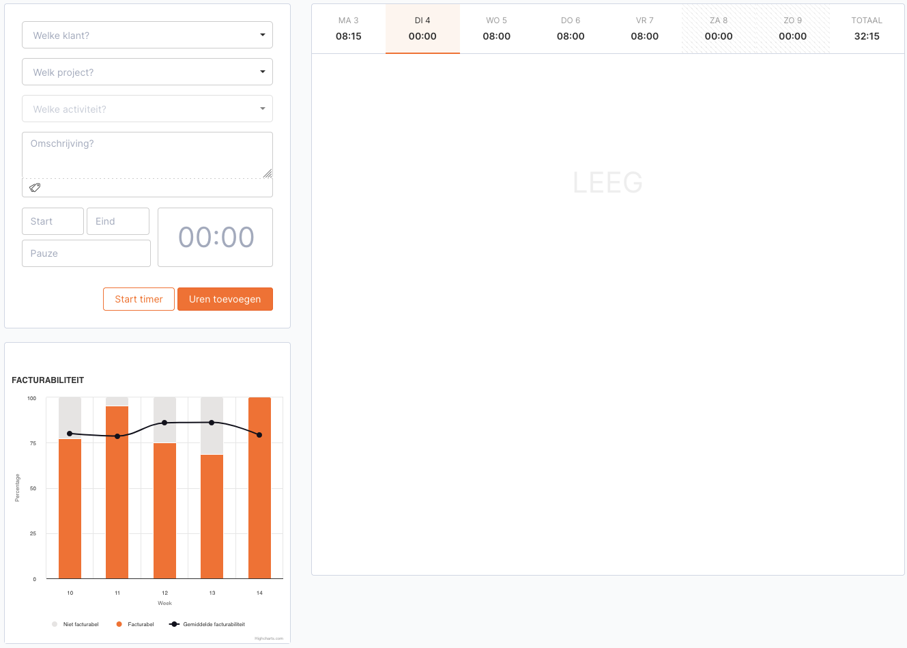

# TimeChimp billability extension

Shows your billability of the last 5 weeks, on basis of the hours within TimeChimp.

Each week includes the average billability of the 4 weeks before. Whenever a week only has days booked on leave or public holidays, a week earlier is used for the average calculation.

## Quick Start

```shell
# Install the dependencies
npm install

# Start the build in watch mode
npm start

# Run the type checks
npm run type-check

# Format the code
npm run format
```

To load the extension in your browser, check the docs for [Chrome](https://developer.chrome.com/docs/extensions/mv3/getstarted/development-basics/#load-unpacked) or [Firefox](https://developer.mozilla.org/en-US/docs/Mozilla/Add-ons/WebExtensions/Your_first_WebExtension#installing).

## Running this extension

1. Clone the main branch of this repository.
2. Install the dependencies.

```shell
npm install
```

3. Build the extension.

```shell
npm run build
```

4. Currently Chrome and Firefox are supported. Only for Firefox change the manifest.json file as follows:

```json
  "background": {
      // "service_worker": "timechimp.js"
     "scripts": ["timechimp.js"]
  },
```
 
5. Load this directory as an unpacked extension in [Chrome](https://developer.chrome.com/docs/extensions/mv3/getstarted/development-basics/#load-unpacked) or [Firefox](https://developer.mozilla.org/en-US/docs/Mozilla/Add-ons/WebExtensions/Your_first_WebExtension#installing).
6. Click the extension icon right next to the address bar and check whether it displays: _Billability charts are now added to the TimeChimp hours page_



7. Open the TimeChimp [hours page](https://app.timechimp.com/#/registration/time/day). 
8. Billability charts should now be represented just beneath the section where you can add hours:


