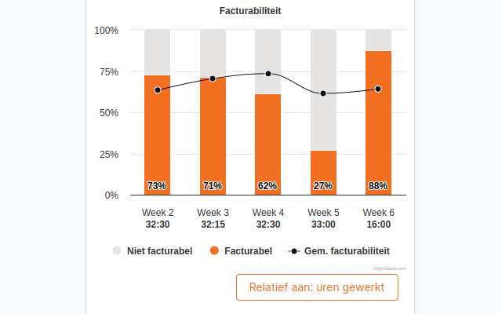

# TimeChimp Billability Chart

[](https://github.com/infi-nl/timechimp-billability-chart/actions/workflows/ci.yml)

A browser extension to show your billability over the past 5 weeks in TimeChimp.


<div style="display: flex; justify-content: space-between;">
  
  
</div>

## Usage

The simplest way to use the extension is via the extension marketplace for your browser.

- [Firefox](https://addons.mozilla.org/en-US/firefox/addon/timechimp-billability-chart)
- [Chrome and Edge](https://chrome.google.com/webstore/detail/timechimp-billability-cha/eleodjmnfjlgiidglnlfclhffhgkgpdp)

## Calculations

The billability is calculated based on the amount of billable hours, and non-billable non-leave hours.
Specifically:

```math
billability = 100 * \frac{billableHours}{totalHours - nonBillableLeaveHours}
```

Here `nonBillableLeaveHours` are time entries related to leave and holidays.
These are entries with the following task names:

- Bijzonder verlof
- Feestdag
- Tijd voor tijd
- Verlof

These are left out to give a better view of your billability in the time you actually worked.

Each week also includes a rolling average billability, which includes the 4 weeks before.
Weeks consisting of only non-billable leave hours are skipped in this rolling average.

## Development

### Quick Start

```shell
# Install the dependencies
npm install

# Start the build in watch mode
npm start

# Run the type checks
npm run type-check

# Format the code
npm run format
```

### Step by Step

First, you need to clone the repository, and install all dependencies:

```shell
git clone ...

npm install
```

To build the extension in watch mode, you can run:

```shell
npm start
```

This will generate various build folders for Chrome and Firefox.
These are called `build_chrome` and `build_firefox` respectively.
You can now load this as an unpacked extension in your browser.
For more info on how to do that, check the instructions
for [Chrome](https://developer.chrome.com/docs/extensions/mv3/getstarted/development-basics/#load-unpacked)
or [Firefox](https://developer.mozilla.org/en-US/docs/Mozilla/Add-ons/WebExtensions/Your_first_WebExtension#installing).

After making changes, be sure to click the "reload" button to let your browser reload the extension code.
Without this, you won't see your changes in the browser.

You can now open [TimeChimp](https://app.timechimp.com/#/registration/time/day),
and you should see the billability chart right below the time entry form.
